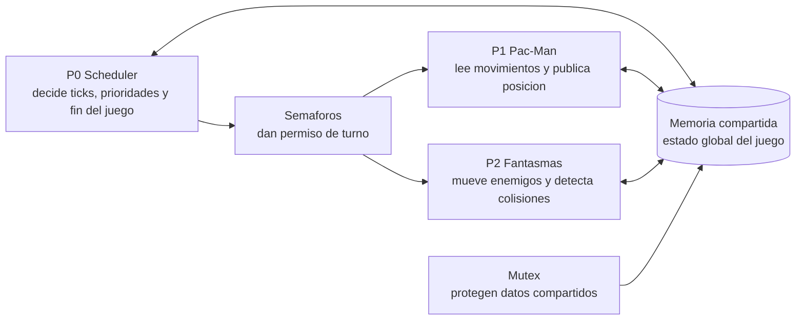
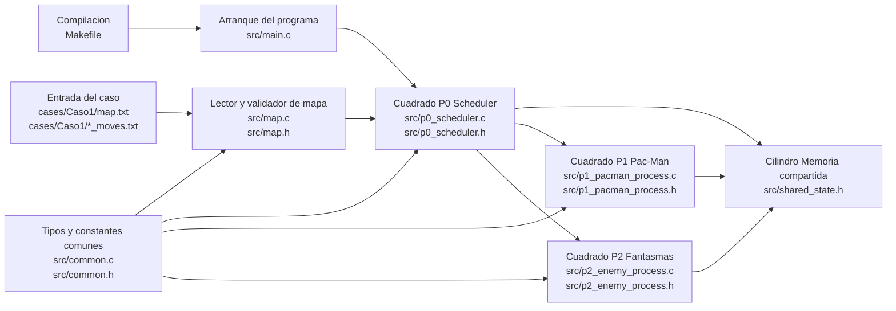
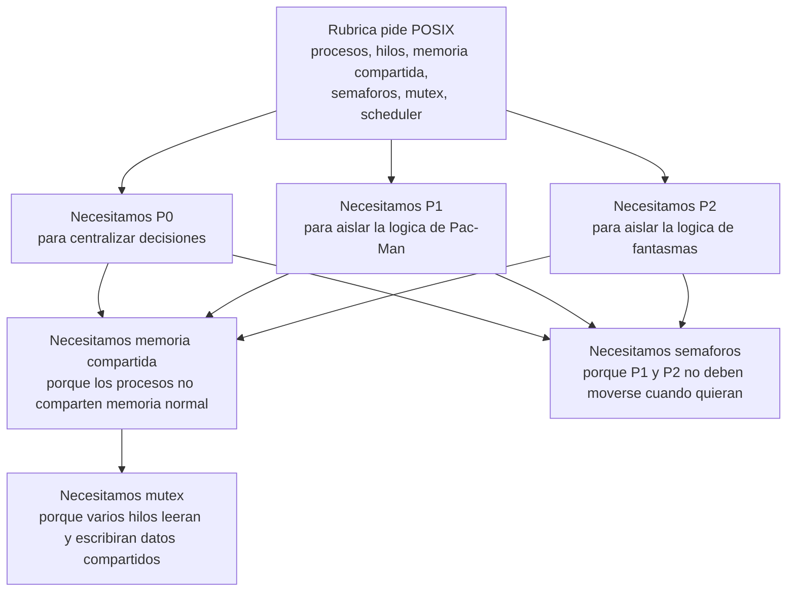
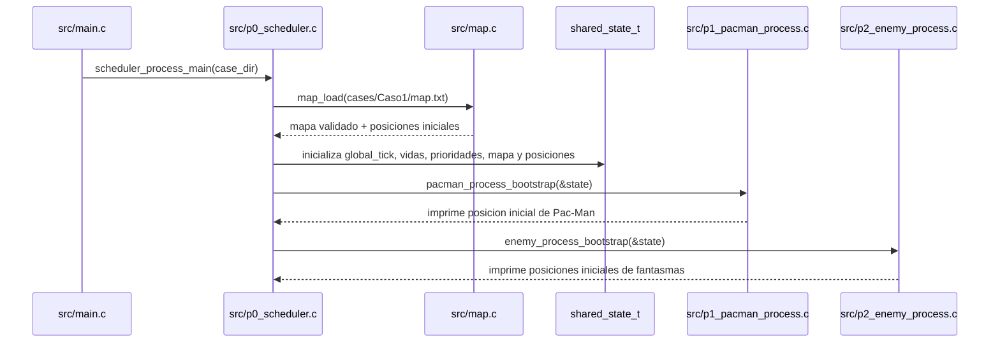
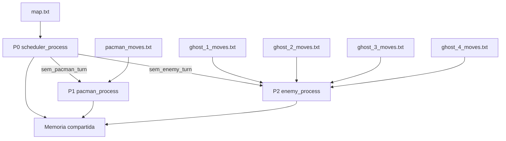
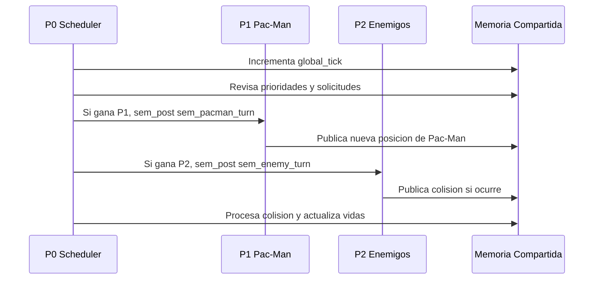
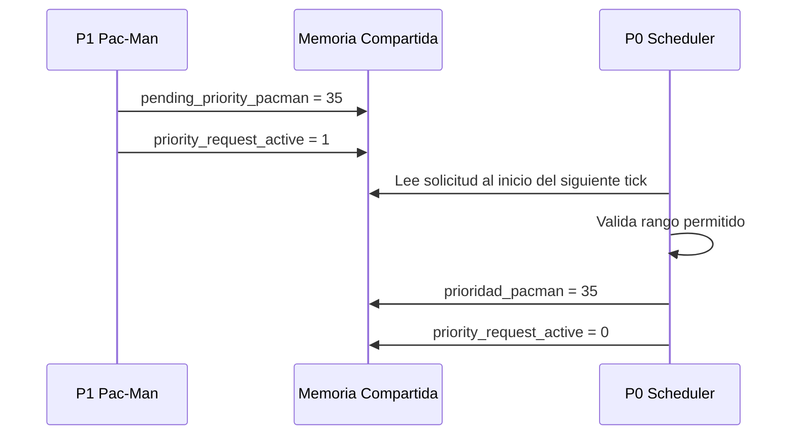
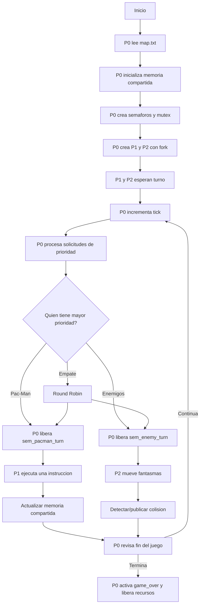
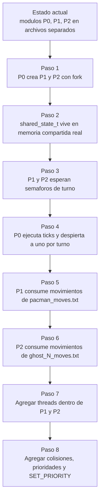

# Guia completa para entender el proyecto Pac-Man concurrente

Esta guia esta pensada para que cualquier integrante del grupo pueda entender el proyecto desde cero: que se esta construyendo, que conceptos de Sistemas Operativos aparecen, que hace cada proceso, que hace cada hilo y como se conectan todas las piezas.

El objetivo no es solo programar un Pac-Man. El objetivo real es demostrar concurrencia, sincronizacion e IPC usando C y POSIX.

## 1. Resumen en una frase

El proyecto simula un Pac-Man donde un proceso principal `P0` funciona como scheduler, un proceso `P1` controla a Pac-Man, un proceso `P2` controla a los fantasmas, y dentro de esos procesos se usan hilos, semaforos, mutex y memoria compartida para coordinar el juego.

## 2. Mapa visual rapido



Lectura rapida:

- `P0` decide quien avanza.
- `P1` mueve a Pac-Man.
- `P2` mueve fantasmas y avisa colisiones.
- La memoria compartida permite que los procesos se comuniquen.
- Los semaforos controlan turnos.
- Los mutex evitan datos corruptos.

### Como se conecta este dibujo con el repo actual

La imagen visual se entiende mejor si cada cuadrado se traduce a archivos reales del proyecto.



Traduccion rapida de la imagen:

| Parte del dibujo | Archivo real | Que hace hoy |
| --- | --- | --- |
| Arranque, antes de P0 | `src/main.c` | Recibe la carpeta del caso y llama a `scheduler_process_main`. |
| P0 Scheduler | `src/p0_scheduler.c` y `src/p0_scheduler.h` | Carga el mapa, inicializa el estado base y llama los modulos de P1 y P2. |
| P1 Pac-Man | `src/p1_pacman_process.c` y `src/p1_pacman_process.h` | Muestra que Pac-Man esta listo y reporta su posicion inicial. |
| P2 Fantasmas | `src/p2_enemy_process.c` y `src/p2_enemy_process.h` | Muestra que los fantasmas estan listos y reporta las posiciones iniciales de A, B, C y D. |
| Memoria compartida | `src/shared_state.h` | Define la estructura `shared_state_t`, que sera el contrato comun entre P0, P1 y P2. |
| Mapa de Pac-Man | `src/map.c` y `src/map.h` | Lee `map.txt`, valida simbolos, valida dimensiones y encuentra `P`, `A`, `B`, `C`, `D`. |
| Constantes comunes | `src/common.c` y `src/common.h` | Define limites, posiciones, nombres de procesos y nombres de fantasmas. |
| Casos de prueba | `cases/Caso1/*` | Contiene el mapa y los archivos de movimientos que luego consumiran P1 y P2. |
| Compilacion | `Makefile` | Define como compilar el proyecto en Linux/WSL con `make`. |

Importante: en el estado actual del GitHub, `P0`, `P1` y `P2` todavia no son procesos separados creados con `fork()`. Ya existen como archivos y modulos separados, que es el primer paso para convertirlos despues en procesos reales. Es como tener el plano electrico antes de cablearlo con POSIX.

### Por que esta arquitectura tiene sentido

La arquitectura no se separo asi por gusto. Se separo asi porque la rubrica pide demostrar conceptos de Sistemas Operativos.



La idea central es esta:

- Si todo estuviera en un solo archivo, seria mas dificil demostrar procesos, comunicacion y sincronizacion.
- Si `P1` o `P2` decidieran sus propios turnos, el scheduler `P0` seria decorativo.
- Si `P1` bajara vidas o cambiara prioridades directamente, se romperian las responsabilidades.
- Si `P2` quitara vidas directamente, habria dos autoridades sobre el estado global.
- Si no existe `shared_state_t`, cada proceso tendria una version distinta del juego.
- Si no hay semaforos, Pac-Man y fantasmas avanzarian sin control del scheduler.
- Si no hay mutex, aparecerian race conditions cuando los hilos lean y escriban al mismo tiempo.

Por eso la regla es:

```text
P0 manda.
P1 obedece turno y mueve Pac-Man.
P2 obedece turno, mueve fantasmas y detecta choques.
shared_state_t guarda el estado comun.
Semaforos dicen quien puede actuar.
Mutex protegen lo que varios pueden tocar a la vez.
```

### Que hace la arquitectura actual cuando ejecutas el programa

Ahora mismo el flujo real del codigo es este:



Eso significa que el avance actual ya responde estas preguntas:

- El programa ya sabe leer un caso.
- El programa ya sabe encontrar a Pac-Man.
- El programa ya sabe encontrar a los cuatro fantasmas.
- El programa ya tiene una estructura central de estado.
- El programa ya esta dividido en P0, P1 y P2 a nivel de archivos.

Pero todavia no responde estas otras:

- Todavia no crea procesos reales con `fork()`.
- Todavia no crea hilos reales con `pthread_create()`.
- Todavia no usa memoria compartida real con `mmap()` o `shm_open()`.
- Todavia no usa semaforos reales.
- Todavia no mueve personajes.
- Todavia no detecta colisiones en ejecucion.

Esta diferencia es clave para explicarselo a la profesora: no decimos "ya esta hecho el proyecto concurrente"; decimos "ya esta armada la base modular y validada la entrada para construir encima la concurrencia POSIX".

## 3. Que esta evaluando realmente el proyecto

La profesora no esta pidiendo solamente un juego bonito. Esta pidiendo una simulacion de Sistemas Operativos.

Lo importante es demostrar:

- Procesos creados con `fork()`.
- Hilos creados con `pthread_create()`.
- Comunicacion entre procesos mediante memoria compartida.
- Coordinacion mediante semaforos.
- Proteccion de datos compartidos mediante mutex.
- Un scheduler propio por ticks y prioridades.
- Manejo de condiciones de carrera.
- Separacion clara de responsabilidades entre procesos.

Pac-Man es el escenario. Sistemas Operativos es el tema central.

## 4. Conceptos que todos deben entender

### Proceso

Un proceso es un programa en ejecucion con su propio espacio de memoria.

En este proyecto:

- `P0` es el proceso scheduler.
- `P1` es el proceso de Pac-Man.
- `P2` es el proceso de enemigos.

Normalmente, un proceso no puede modificar directamente la memoria de otro proceso. Por eso necesitamos memoria compartida.

### Hilo

Un hilo es una unidad de ejecucion dentro de un proceso.

Los hilos del mismo proceso comparten memoria entre ellos. Esto es util, pero tambien peligroso: si dos hilos modifican el mismo dato al mismo tiempo, puede aparecer una race condition.

En este proyecto:

- `P1` puede tener hilos para leer movimientos, ejecutar movimientos y publicar estado.
- `P2` puede tener hilos para cada fantasma, para rastrear a Pac-Man y para detectar colisiones.

### Memoria compartida

La memoria compartida es una zona que pueden ver varios procesos.

Sirve para que `P0`, `P1` y `P2` compartan informacion como:

- Tick actual.
- Estado de fin del juego.
- Posicion de Pac-Man.
- Vidas de Pac-Man.
- Prioridades.
- Evento de colision.
- Mapa del laberinto.

Sin memoria compartida, `P0` no podria saber facilmente donde esta Pac-Man o si `P2` detecto una colision.

### Semaforo

Un semaforo sirve para bloquear o despertar procesos/hilos.

En este proyecto, `P0` usara semaforos para dar permiso de ejecucion:

- `sem_pacman_turn`: permite avanzar a `P1`.
- `sem_enemy_turn`: permite avanzar a `P2`.

La idea es que `P1` y `P2` no avancen cuando quieran. Deben esperar a que el scheduler les de turno.

### Mutex

Un mutex protege una seccion critica.

Una seccion critica es una parte del codigo donde se lee o escribe un dato compartido.

Ejemplo:

```c
pthread_mutex_lock(&state_mutex);
shared->pacman_x = nuevo_x;
shared->pacman_y = nuevo_y;
pthread_mutex_unlock(&state_mutex);
```

El mutex evita que otro hilo/proceso lea una posicion incompleta mientras Pac-Man se esta actualizando.

### Race condition

Una race condition ocurre cuando dos o mas hilos/procesos acceden al mismo dato al mismo tiempo y el resultado depende del orden exacto de ejecucion.

Ejemplo peligroso:

- `movement_executor_thread` cambia la posicion de Pac-Man.
- `pacman_publisher_thread` intenta publicarla al mismo tiempo.
- `collision_thread` lee esa posicion justo en medio del cambio.

Solucion: proteger esos datos con mutex.

### Deadlock

Un deadlock ocurre cuando dos o mas hilos/procesos quedan esperando para siempre.

Ejemplo:

- Hilo 1 tiene `mutex_A` y espera `mutex_B`.
- Hilo 2 tiene `mutex_B` y espera `mutex_A`.

Ninguno puede avanzar.

Para evitarlo, el proyecto debe:

- Usar pocos mutex bien definidos.
- Tomar mutex siempre en el mismo orden.
- Liberar mutex rapidamente.
- No hacer operaciones lentas mientras se sostiene un mutex.

### Scheduler

Un scheduler decide quien ejecuta.

En un sistema operativo real, el scheduler decide que proceso usa CPU. En este proyecto, `P0` simula esa idea:

- Incrementa ticks.
- Revisa prioridades.
- Decide si avanza Pac-Man o enemigos.
- Libera el semaforo correspondiente.

### Tick

Un tick es una unidad logica de tiempo del juego.

En cada tick, el scheduler decide que proceso puede ejecutar una accion.

Ejemplo:

```text
Tick 1: ejecuta P2
Tick 2: ejecuta P2
Tick 3: ejecuta P1
Tick 4: ejecuta P2
```

### Prioridad

Cada proceso tiene una prioridad.

Si `prioridad_enemy > prioridad_pacman`, entonces `P2` tiene preferencia.

Si `prioridad_pacman > prioridad_enemy`, entonces `P1` tiene preferencia.

Si ambas prioridades empatan, se usa Round Robin.

### Round Robin

Round Robin significa alternar turnos cuando hay empate.

Ejemplo:

```text
prioridad_pacman = 30
prioridad_enemy = 30

Tick 1: P1
Tick 2: P2
Tick 3: P1
Tick 4: P2
```

Esto evita que un proceso monopolice la simulacion.

### IPC

IPC significa Inter-Process Communication, o comunicacion entre procesos.

En este proyecto hay IPC porque:

- `P1` publica la posicion de Pac-Man.
- `P2` lee la posicion de Pac-Man.
- `P2` publica eventos de colision.
- `P0` lee esos eventos y actualiza vidas.
- `P1` y `P2` piden cambios de prioridad a `P0`.

## 5. Vision general de la arquitectura



La idea principal:

- `P0` manda.
- `P1` mueve a Pac-Man cuando recibe permiso.
- `P2` mueve fantasmas cuando recibe permiso.
- La memoria compartida conecta a todos.

## 6. Que hace P0

`P0` es el proceso principal y representa al scheduler.

No debe mover directamente a Pac-Man. No debe mover directamente a los fantasmas.

Su trabajo es coordinar.

Responsabilidades de `P0`:

- Leer `map.txt`.
- Validar que el mapa tenga `P`, `A`, `B`, `C`, `D`.
- Crear e inicializar memoria compartida.
- Inicializar variables globales:
  - `global_tick`
  - `max_ticks`
  - `game_over`
  - `pacman_lives`
  - `prioridad_pacman`
  - `prioridad_enemy`
- Crear semaforos.
- Crear mutex.
- Crear procesos hijos `P1` y `P2` usando `fork()`.
- Ejecutar el ciclo de ticks.
- Decidir que proceso ejecuta en cada tick.
- Procesar solicitudes de cambio de prioridad.
- Procesar eventos de colision.
- Reducir vidas de Pac-Man.
- Decidir cuando termina el juego.
- Despertar a `P1` y `P2` para que puedan terminar ordenadamente.

Lo mas importante de `P0`: centraliza las decisiones globales.

## 7. Que hace P1

`P1` controla a Pac-Man.

No decide cuando juega. Solo actua cuando `P0` le da permiso con `sem_pacman_turn`.

Responsabilidades de `P1`:

- Leer `pacman_moves.txt`.
- Guardar movimientos en una cola interna.
- Esperar permiso del scheduler.
- Consumir una instruccion por turno.
- Validar si el movimiento choca contra pared.
- Actualizar posicion local de Pac-Man.
- Actualizar puntaje si corresponde.
- Publicar posicion y puntaje en memoria compartida.
- Si lee `SET_PRIORITY <NUMBER>`, no cambia la prioridad directamente.
- En vez de eso, escribe una solicitud para que `P0` la procese.

Hilos recomendados dentro de `P1`:

```text
P1 pacman_process
  movement_reader_thread
  movement_executor_thread
  pacman_publisher_thread
```

### movement_reader_thread

Lee `pacman_moves.txt` y mete instrucciones en una cola.

Ejemplo de instrucciones:

```text
RIGHT
DOWN
LEFT
SET_PRIORITY 35
```

Este hilo produce movimientos.

### movement_executor_thread

Espera permiso del scheduler.

Cuando `P0` hace `sem_post(&sem_pacman_turn)`, este hilo puede consumir una instruccion de la cola.

Luego:

- Calcula nueva posicion.
- Revisa si la celda es pared `X`.
- Si es pared, no se mueve.
- Si es camino, actualiza la posicion.

Este hilo consume movimientos.

### pacman_publisher_thread

Publica el estado actualizado en memoria compartida.

Publica datos como:

- `pacman_x`
- `pacman_y`
- `pacman_score`

Debe usar mutex para no publicar informacion incompleta.

## 8. Que hace P2

`P2` controla a los fantasmas.

Tampoco decide cuando juega. Solo actua cuando `P0` le da permiso con `sem_enemy_turn`.

Responsabilidades de `P2`:

- Controlar 4 fantasmas.
- Leer un archivo distinto para cada fantasma.
- Mover fantasmas cuando el scheduler da turno.
- Validar paredes.
- Leer la posicion actual de Pac-Man desde memoria compartida.
- Detectar colisiones.
- Publicar un evento de colision.

Importante: `P2` no debe quitar vidas directamente. Solo avisa que hubo una colision. `P0` es quien reduce vidas.

Hilos recomendados dentro de `P2`:

```text
P2 enemy_process
  enemy_controller_thread
  ghost_thread_1
  ghost_thread_2
  ghost_thread_3
  ghost_thread_4
  pacman_tracker_thread
  collision_thread
```

### enemy_controller_thread

Espera el turno de enemigos.

Cuando `P0` libera `sem_enemy_turn`, este hilo despierta internamente a los hilos de fantasmas.

Su papel es coordinar el movimiento conjunto de enemigos.

### ghost_thread_1 a ghost_thread_4

Cada fantasma tiene su propio hilo.

Cada hilo:

- Lee su propio archivo.
- Consume una instruccion cuando `P2` tiene turno.
- Calcula nueva posicion.
- Valida paredes.
- Actualiza su posicion interna.

Archivos:

```text
ghost_1_moves.txt
ghost_2_moves.txt
ghost_3_moves.txt
ghost_4_moves.txt
```

### pacman_tracker_thread

Lee la posicion de Pac-Man desde memoria compartida.

Mantiene una copia local dentro de `P2`.

Esto permite que `collision_thread` no tenga que leer memoria compartida todo el tiempo.

### collision_thread

Compara:

- Posicion local de Pac-Man.
- Posiciones internas de los fantasmas.

Si detecta choque, publica en memoria compartida:

- `collision_detected = 1`
- `collision_tick = global_tick`
- `collision_ghost_id = id_del_fantasma`

Despues `P0` procesa ese evento.

## 9. Como funciona un tick

Un tick representa un paso logico del juego.



En una implementacion estricta, en cada tick se permite avanzar a un proceso:

- O avanza `P1`.
- O avanza `P2`.

Si le toca a `P1`, Pac-Man consume una instruccion.

Si le toca a `P2`, cada fantasma puede consumir una instruccion dentro de ese turno.

## 10. Archivos de entrada

Cada caso tiene su propia carpeta.

```text
cases/
  Caso1/
    map.txt
    pacman_moves.txt
    ghost_1_moves.txt
    ghost_2_moves.txt
    ghost_3_moves.txt
    ghost_4_moves.txt
```

### map.txt

Define el laberinto.

Simbolos:

```text
X = pared
O = camino libre
P = posicion inicial de Pac-Man
A = fantasma 1
B = fantasma 2
C = fantasma 3
D = fantasma 4
* = power pellet opcional
```

Ejemplo:

```text
XXXXXXXXXXXX
XPOOOOOOOOAX
XOXXXXXXOOOX
XBOOOOOOOOCX
XOOXXXXXXOOX
XDOOOOOOOOOX
XXXXXXXXXXXX
```

El programa debe detectar:

- Donde empieza Pac-Man.
- Donde empieza cada fantasma.
- Que celdas son paredes.
- Que celdas son transitables.

### pacman_moves.txt

Contiene instrucciones de Pac-Man.

Ejemplo:

```text
RIGHT
RIGHT
DOWN
LEFT
SET_PRIORITY 35
```

### ghost_N_moves.txt

Cada fantasma tiene su propio archivo.

Ejemplo:

```text
LEFT
UP
RIGHT
DOWN
```

Esto permite que los fantasmas se muevan de forma concurrente dentro de `P2`.

## 11. Memoria compartida

La memoria compartida debe contener la informacion que varios procesos necesitan ver.

Variables sugeridas:

```c
typedef struct {
    int global_tick;
    int max_ticks;
    int game_over;

    int pacman_x;
    int pacman_y;
    int pacman_score;
    int pacman_lives;

    int collision_detected;
    int collision_tick;
    int collision_ghost_id;

    int prioridad_pacman;
    int prioridad_enemy;

    int pending_priority_pacman;
    int priority_request_active;

    int pending_priority_enemy;
    int enemy_priority_request_active;

    char map_grid[MAX_Y][MAX_X];

    sem_t sem_pacman_turn;
    sem_t sem_enemy_turn;

    pthread_mutex_t state_mutex;
    pthread_mutex_t priority_mutex;
    pthread_mutex_t collision_mutex;
} shared_state_t;
```

## 12. Quien escribe y quien lee cada dato

| Dato | Lo escribe | Lo lee | Proteccion |
| --- | --- | --- | --- |
| `global_tick` | `P0` | `P0`, `P1`, `P2` | `state_mutex` |
| `game_over` | `P0` | `P1`, `P2` | `state_mutex` |
| `pacman_x`, `pacman_y` | `P1` | `P0`, `P2` | `state_mutex` |
| `pacman_lives` | `P0` | `P0`, opcionalmente `P1` | `state_mutex` |
| `prioridad_pacman` | `P0` | `P0` | `priority_mutex` |
| `prioridad_enemy` | `P0` | `P0` | `priority_mutex` |
| `priority_request_active` | `P1` | `P0` | `priority_mutex` |
| `enemy_priority_request_active` | `P2` | `P0` | `priority_mutex` |
| `collision_detected` | `P2` | `P0` | `collision_mutex` |
| `collision_tick` | `P2` | `P0` | `collision_mutex` |
| `collision_ghost_id` | `P2` | `P0` | `collision_mutex` |
| `map_grid` | `P0` al inicio | `P1`, `P2` | Solo lectura despues de inicializar |

Regla mental:

- Si varios escriben, casi seguro necesita mutex.
- Si uno escribe y otros leen mientras el programa corre, tambien conviene proteger.
- Si se inicializa una vez y luego solo se lee, no necesita tanto bloqueo.

## 13. Como se procesa SET_PRIORITY

`SET_PRIORITY` no debe cambiar directamente la prioridad del proceso.

El proceso debe pedir el cambio.

Ejemplo:

```text
P1 lee: SET_PRIORITY 35
```

Flujo correcto:



Por que hacerlo asi:

- Mantiene a `P0` como autoridad central.
- Evita que `P1` o `P2` modifiquen prioridades unilateralmente.
- Hace que el scheduler sea real, no decorativo.

## 14. Como se detecta una colision

Una colision ocurre si Pac-Man y un fantasma terminan en la misma posicion.

Tambien podria considerarse colision por cruce:

```text
Antes:
Pac-Man en (1,1)
Fantasma en (2,1)

Despues:
Pac-Man en (2,1)
Fantasma en (1,1)
```

En ese caso se cruzaron.

Flujo basico:

```text
P2 mueve fantasmas
P2 compara posiciones con Pac-Man
P2 publica collision_detected
P0 lee collision_detected
P0 reduce pacman_lives
P0 decide si game_over = 1
```

P2 detecta. P0 decide.

Esa separacion es importante para la arquitectura.

## 15. Race conditions importantes del proyecto

| Situacion peligrosa | Por que es peligrosa | Solucion |
| --- | --- | --- |
| `P1` actualiza posicion mientras `P2` la lee | `P2` podria leer una posicion incompleta | Proteger con `state_mutex` |
| Varios fantasmas actualizan `ghost_positions[]` | `collision_thread` podria leer datos mezclados | Proteger con mutex interno de `P2` |
| `P1` escribe solicitud de prioridad mientras `P0` la lee | `P0` podria leer solicitud incompleta | Proteger con `priority_mutex` |
| `P2` publica colision mientras `P0` la procesa | Se podria perder o duplicar evento | Proteger con `collision_mutex` |
| `P1` consume cola mientras otro hilo inserta movimientos | La cola podria corromperse | Mutex de cola y semaforo de items |
| `game_over` cambia mientras hilos esperan | Pueden quedar bloqueados | `P0` debe liberar semaforos al terminar |

## 16. Flujo completo del juego



## 17. Estado actual del proyecto

Actualmente ya existe una base inicial con:

- Estructura de carpetas.
- `Makefile`.
- Archivos separados para `P0`, `P1`, `P2`.
- Lector de `map.txt`.
- Validacion de simbolos del mapa.
- Deteccion de posiciones iniciales:
  - `P`
  - `A`
  - `B`
  - `C`
  - `D`
- Caso de prueba `Caso1`.

Archivos principales actuales:

```text
src/
  main.c
  common.c
  common.h
  shared_state.h
  map.c
  map.h
  p0_scheduler.c
  p0_scheduler.h
  p1_pacman_process.c
  p1_pacman_process.h
  p2_enemy_process.c
  p2_enemy_process.h
```

### Explicacion archivo por archivo

Esta tabla sirve para que cualquier integrante pueda abrir el repo y saber donde mirar.

| Archivo | Rol dentro del proyecto | Que hace actualmente | Que hara despues |
| --- | --- | --- | --- |
| `src/main.c` | Entrada del programa | Define que caso se ejecuta. Si no recibe argumento, usa `cases/Caso1`. Luego llama a `scheduler_process_main`. | Seguira siendo pequeño. Solo arrancara P0 y pasara la carpeta del caso. |
| `src/common.h` | Definiciones comunes | Define limites del mapa, cantidad de fantasmas, tipo `position_t` y enum de procesos. | Puede crecer con enums de direccion, codigos de error o tipos comunes. |
| `src/common.c` | Utilidades comunes | Convierte ids de procesos y fantasmas a nombres imprimibles. | Puede agregar helpers compartidos si no pertenecen a P0, P1, P2 ni mapa. |
| `src/map.h` | Contrato del modulo de mapa | Define `game_map_t` y declara funciones para cargar, validar e imprimir resumen del mapa. | Se mantendra como interfaz limpia para que P0, P1 y P2 no lean archivos de mapa directamente. |
| `src/map.c` | Logica de lectura de mapa | Abre `map.txt`, valida simbolos, valida que todas las filas tengan igual ancho y encuentra posiciones iniciales. | Se usara tambien para validar si una celda es transitable antes de mover personajes. |
| `src/shared_state.h` | Modelo del estado global | Define `shared_state_t` con tick, vidas, mapa, posiciones, prioridades y campos de colision. | Se convertira en la estructura ubicada dentro de memoria compartida real. Tambien agregara semaforos y mutex interproceso si se decide meterlos ahi. |
| `src/p0_scheduler.h` | Contrato de P0 | Declara `scheduler_process_main`. | Mantendra la entrada publica de P0. |
| `src/p0_scheduler.c` | Cuadrado P0 Scheduler | Carga el mapa, inicializa `shared_state_t`, define vidas/prioridades iniciales y llama a los bootstraps de P1 y P2. | Creara memoria compartida, semaforos, mutex, hara `fork()`, correra ticks, aplicara prioridades, procesara colisiones y cerrara recursos. |
| `src/p1_pacman_process.h` | Contrato de P1 | Declara `pacman_process_bootstrap`. | Expondra la funcion principal del proceso P1. |
| `src/p1_pacman_process.c` | Cuadrado P1 Pac-Man | Imprime que P1 esta listo y muestra la posicion inicial de Pac-Man. | Leera `pacman_moves.txt`, creara threads internos, movera Pac-Man cuando P0 libere su semaforo y publicara su posicion en memoria compartida. |
| `src/p2_enemy_process.h` | Contrato de P2 | Declara `enemy_process_bootstrap`. | Expondra la funcion principal del proceso P2. |
| `src/p2_enemy_process.c` | Cuadrado P2 Fantasmas | Imprime que P2 esta listo y muestra la posicion inicial de cada fantasma. | Creara threads de fantasmas, leera `ghost_N_moves.txt`, movera enemigos con turno del scheduler y publicara eventos de colision. |
| `cases/Caso1/map.txt` | Laberinto del caso 1 | Define paredes, caminos, Pac-Man y fantasmas iniciales. | Sera usado por P0 para inicializar el estado compartido real. |
| `cases/Caso1/pacman_moves.txt` | Entrada de movimientos de Pac-Man | Esta preparado como archivo de instrucciones. | Lo leera un thread de P1 y lo pondra en una cola de movimientos. |
| `cases/Caso1/ghost_1_moves.txt` a `ghost_4_moves.txt` | Entrada de movimientos de fantasmas | Estan preparados como archivos de instrucciones. | Cada thread de fantasma consumira su propio archivo o cola de movimientos. |
| `Makefile` | Compilacion | Define como compilar el ejecutable. | Se ajustara para enlazar `pthread` y cualquier fuente nueva como `sync_utils.c` o `movement_queue.c`. |
| `PLAN_PROYECTO_PACMAN.md` | Plan resumido | Explica el orden publico del proyecto. | Puede mantenerse como plan corto para entregar o revisar rapido. |
| `GUIA_COMPLETA_PACMAN_CONCURRENTE.md` | Guia de estudio y arquitectura | Explica conceptos, arquitectura, archivos y siguientes pasos. | Se actualizara conforme se implementen `fork()`, threads, semaforos y scheduler real. |

### Donde encaja cada archivo en la imagen visual

```text
Imagen visual
|
+-- P0 Scheduler
|   +-- src/p0_scheduler.c
|   +-- src/p0_scheduler.h
|
+-- P1 Pac-Man
|   +-- src/p1_pacman_process.c
|   +-- src/p1_pacman_process.h
|
+-- P2 Fantasmas
|   +-- src/p2_enemy_process.c
|   +-- src/p2_enemy_process.h
|
+-- Memoria compartida
|   +-- src/shared_state.h
|
+-- Semaforos y mutex
|   +-- Todavia no existen como modulo real
|   +-- Probable siguiente archivo: src/sync_utils.c
|   +-- Probable siguiente archivo: src/sync_utils.h
|
+-- Cola de movimientos de P1
|   +-- Todavia no existe como modulo real
|   +-- Probable siguiente archivo: src/movement_queue.c
|   +-- Probable siguiente archivo: src/movement_queue.h
|
+-- Lectura del mapa
|   +-- src/map.c
|   +-- src/map.h
|
+-- Base comun
    +-- src/common.c
    +-- src/common.h
```

Todavia falta implementar:

- `fork()`.
- Memoria compartida real con `mmap()` o `shm_open()`.
- Semaforos reales.
- Mutex interproceso.
- Threads reales con `pthread_create()`.
- Movimiento de Pac-Man.
- Movimiento de fantasmas.
- Cola de movimientos.
- Scheduler por prioridades.
- `SET_PRIORITY`.
- Colisiones.
- Condicion de fin.

## 18. Como explicar el avance actual

Una explicacion clara:

```text
En este avance se construyo la base del proyecto. Ya se separo la arquitectura en tres modulos principales: P0, P1 y P2. P0 representa al scheduler, P1 representa al proceso de Pac-Man y P2 representa al proceso de fantasmas. Tambien se implemento la lectura de map.txt, validando los simbolos permitidos y detectando las posiciones iniciales de Pac-Man y los cuatro fantasmas. Este avance todavia no ejecuta procesos reales con fork, pero deja preparada la estructura para hacerlo en la siguiente etapa.
```

## 19. Orden recomendado para continuar

El siguiente orden tiene sentido:

1. Convertir `P0`, `P1`, `P2` en procesos reales con `fork()`.
2. Crear memoria compartida real.
3. Copiar `shared_state_t` a memoria compartida.
4. Crear semaforos `sem_pacman_turn` y `sem_enemy_turn`.
5. Hacer que `P1` y `P2` esperen su semaforo.
6. Implementar scheduler basico por ticks.
7. Implementar movimiento de Pac-Man.
8. Implementar movimiento de fantasmas.
9. Agregar threads en `P1`.
10. Agregar threads en `P2`.
11. Proteger recursos con mutex.
12. Agregar colisiones.
13. Agregar prioridades y Round Robin.
14. Agregar `SET_PRIORITY`.
15. Agregar finalizacion ordenada.

### Proximo avance recomendado en detalle

El proximo avance no deberia empezar por mover fantasmas todavia. Primero conviene convertir la arquitectura modular actual en arquitectura POSIX real.



El avance inmediato podria quedar asi:

1. Crear `sync_utils.c` y `sync_utils.h`.
2. Mover la inicializacion de memoria compartida a una funcion clara.
3. Agregar semaforos `sem_pacman_turn` y `sem_enemy_turn`.
4. Cambiar `scheduler_process_main` para hacer `fork()` de P1 y P2.
5. Hacer que P1 y P2 impriman su PID y esperen turno.
6. Hacer un scheduler minimo de 5 a 10 ticks.
7. En cada tick, P0 libera solo un semaforo.
8. P1 o P2 imprimen que recibieron turno.
9. Al final, P0 activa `game_over`.
10. P0 libera semaforos para que P1 y P2 salgan ordenadamente.

Ese avance todavia no necesita mover personajes. Su objetivo es probar lo mas importante: que ya existen procesos reales, memoria compartida y turnos controlados por semaforos.

Despues de eso recien conviene agregar movimiento:

1. P1 lee `pacman_moves.txt`.
2. P1 valida paredes con `map_is_walkable`.
3. P1 actualiza `pacman_position`.
4. P2 lee archivos de fantasmas.
5. P2 actualiza posiciones internas.
6. P2 compara contra Pac-Man.
7. P2 publica colision.
8. P0 baja vidas.

Y despues de movimiento conviene agregar threads:

1. En P1, thread lector, thread ejecutor y thread publicador.
2. En P2, thread controlador, cuatro threads de fantasmas, tracker de Pac-Man y detector de colisiones.
3. Agregar mutex para proteger colas, posiciones, prioridades y colisiones.
4. Agregar `SET_PRIORITY` y Round Robin.

La razon de este orden es simple: primero se prueba la comunicacion entre procesos; luego se agrega logica de juego; al final se agregan hilos, prioridades y condiciones de carrera. Si se intenta hacer todo junto, los errores se mezclan y cuesta saber si fallo el mapa, el `fork()`, el semaforo, el movimiento o el thread.

## 20. Que debe poder responder cada integrante

Todos deberian poder responder:

- Que hace `P0`.
- Que hace `P1`.
- Que hace `P2`.
- Por que usamos procesos.
- Por que usamos hilos.
- Que datos estan en memoria compartida.
- Que datos deben protegerse con mutex.
- Como se evitan race conditions.
- Como el scheduler decide turnos.
- Que pasa cuando hay colision.
- Por que `P2` no baja vidas directamente.
- Por que `P1` no cambia su prioridad directamente.
- Como se termina el juego.

## 21. Idea clave para no perderse

La arquitectura se entiende mejor con esta regla:

```text
P0 decide.
P1 mueve a Pac-Man.
P2 mueve fantasmas y detecta colisiones.
La memoria compartida conecta a todos.
Los semaforos dan permiso.
Los mutex protegen datos.
```

Si recuerdan eso, el proyecto completo empieza a tener sentido.
